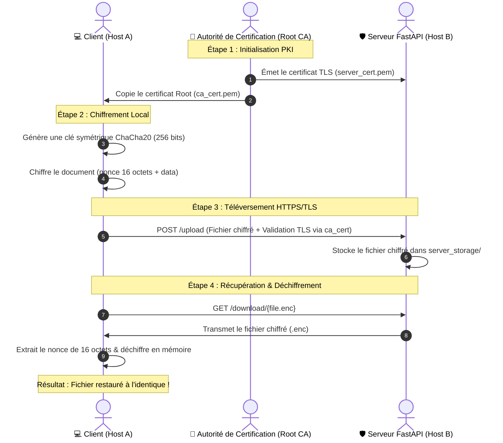

# 🛡️ Corvus Drop

[](https://www.python.org/)
[](https://fastapi.tiangolo.com/)
[](https://streamlit.io/)
[](https://cryptography.io/)

**Corvus Drop** est un laboratoire et un système de transfert de fichiers chiffrés de bout en bout hautement sécurisé. Il repose sur une architecture client-serveur moderne exploitant des algorithmes de cryptographie de pointe (courbes elliptiques ECC et chiffrement symétrique ChaCha20) sécurisés par un canal de transport TLS natif.

L'application intègre également un outil interactif d'analyse de certificats HTTPS réels pour n'importe quel nom de domaine public.

---

## 📂 Structure du Projet

Le projet est divisé en deux composants isolés et autonomes, chacun disposant de ses propres responsabilités :

```text
Corvus Drop/
├── 📂 client/              # --- CÔTÉ CLIENT (Host A) ---
│   ├── client.py           # Script client CLI de test (chiffrement & upload)
│   ├── interface.py        # Interface premium Streamlit (ECC Lab & Inspecteur HTTPS)
│   └── ca_cert.pem         # Certificat de confiance de la Root CA (généré)
│
└── 📂 server/              # --- CÔTÉ SERVEUR (Host B) ---
    ├── server.py           # Serveur FastAPI HTTPS Premium
    ├── pki_setup.py        # Initialisateur de la PKI locale
    ├── ca_cert.pem         # Certificat public de la Root CA (généré)
    ├── ca_private_key.pem  # Clé privée Root CA (généré)
    ├── server_cert.pem     # Certificat TLS serveur (généré)
    ├── server_private_key.pem          # Clé privée TLS serveur (généré)
    └── 📂 server_storage/  # Coffre-fort de stockage sécurisé du serveur
```

---

## ⚙️ Cryptographie & Sécurité



---

## 🛠️ Guide de Démarrage & Protocole de Test

Suivez ces étapes pour configurer et tester l'ensemble du projet localement.

### 📋 Prérequis
Installez les dépendances Python requises :
```bash
pip install fastapi uvicorn requests streamlit cryptography
```

---

### Étape 1 : Initialiser la PKI Locale
Avant de pouvoir lancer le serveur web sécurisé, vous devez initialiser votre autorité de certification (CA) et générer les certificats de chiffrement :

1. Ouvrez un terminal et accédez au dossier `server/` :
   ```bash
   cd server
   ```
2. Lancez le script de la PKI :
   ```bash
   python pki_setup.py
   ```

> [!NOTE]
> **Fonctionnement "Smart Sync" :** Ce script crée une clé privée CA racine unique et génère un certificat serveur signé avec Subject Alternative Names (SAN) pour autoriser les connexions locales. Le script **copie automatiquement** la clé publique `ca_cert.pem` dans le dossier `client/` pour le client TLS.

---

### Étape 2 : Activer la confiance TLS locale (Cadenas Vert)
Pour éliminer les avertissements de sécurité de votre système d'exploitation et obtenir une validation TLS parfaite :

* **Sous Windows (PowerShell en tant qu'Administrateur) :**
  Accédez à la racine du projet et exécutez :
  ```powershell
  Import-Certificate -FilePath "client/ca_cert.pem" -CertStoreLocation Cert:\LocalMachine\Root
  ```
* **Pour Mozilla Firefox :**
  Importez `client/ca_cert.pem` dans **Paramètres** -> **Vie privée et sécurité** -> **Afficher les certificats** -> **Autorités** -> **Importer**.

---

### Étape 3 : Lancer le Serveur API HTTPS
1. Dans votre terminal dans le dossier `server/`, lancez le serveur FastAPI :
   ```bash
   python server.py
   ```
2. Ouvrez votre navigateur web pour accéder aux interfaces de contrôle :
   * **Dashboard d'administration premium :** [https://localhost:8443](https://localhost:8443)
   * **Portail API Swagger interactif :** [https://localhost:8443/docs](https://localhost:8443/docs)

---

### Étape 4 : Valider la simulation CLI (Client simple)
Ce test vérifie le flux de chiffrement, l'upload et le déchiffrement en ligne de commande.

1. Ouvrez un **nouveau** terminal et déplacez-vous dans le dossier `client/` :
   ```bash
   cd client
   ```
2. Lancez le script client :
   ```bash
   python client.py
   ```
3. Appuyez sur **Entrée** lorsque le script vous le demande. 
4. Vérifiez que la console affiche :
   * La clé symétrique ChaCha20 générée en hexadécimal.
   * La confirmation de la réussite du chiffrement local et de l'upload.
   * La restauration parfaite du contenu original déchiffré depuis le fichier téléchargé.

---

### Étape 5 : Tester l'Interface Graphique Streamlit
Le client dispose d'une interface premium complète intégrant tous nos outils cryptographiques.

1. Dans le dossier `client/`, lancez Streamlit :
   ```bash
   streamlit run interface.py
   ```
2. L'application s'ouvre automatiquement à l'adresse `http://localhost:8501`.

#### 🧪 Scénarios de tests recommandés :
- **Inspecteur HTTPS Réel** : Entrez `github.com` ou `google.com` dans le premier onglet. L'application effectuera un handshake TLS réel et extraira les détails cryptographiques du certificat X.509 distant (autorité de certification, validité, clés publiques asymétriques).
- **PKI & Certificats ECC** : Utilisez le simulateur de l'onglet 2 pour créer interactivement des autorités racines et signer de nouveaux certificats serveurs. *Les fichiers générés sont automatiquement synchronisés avec le dossier `server/`.*
- **Coffre-fort client (ChaCha20)** :
  1. Générez une clé symétrique de 256 bits dans l'onglet **Gestion des Clés**.
  2. Importez un fichier local en clair dans l'onglet **Upload** puis cliquez sur **🔒 Chiffrer et Téléverser**.
  3. Allez sur votre dashboard serveur `https://localhost:8443` pour observer le fichier chiffré `.enc` dans l'inventaire du coffre-fort.
  4. Saisissez le nom du fichier chiffré dans l'onglet **Download** du client pour le télécharger, le déchiffrer en mémoire et le restaurer localement.

---

## 🛡️ Bonnes Pratiques en Production
- Dans ce laboratoire, les clés privées (`*.pem`) sont générées sans mot de passe pour faciliter le test local. Dans un environnement de production, les clés d'autorité doivent être chiffrées avec un mot de passe fort via KDF.
- Restreignez toujours les droits de lecture NTFS/POSIX sur vos clés privées (permissions 600 sous Linux/Unix).
